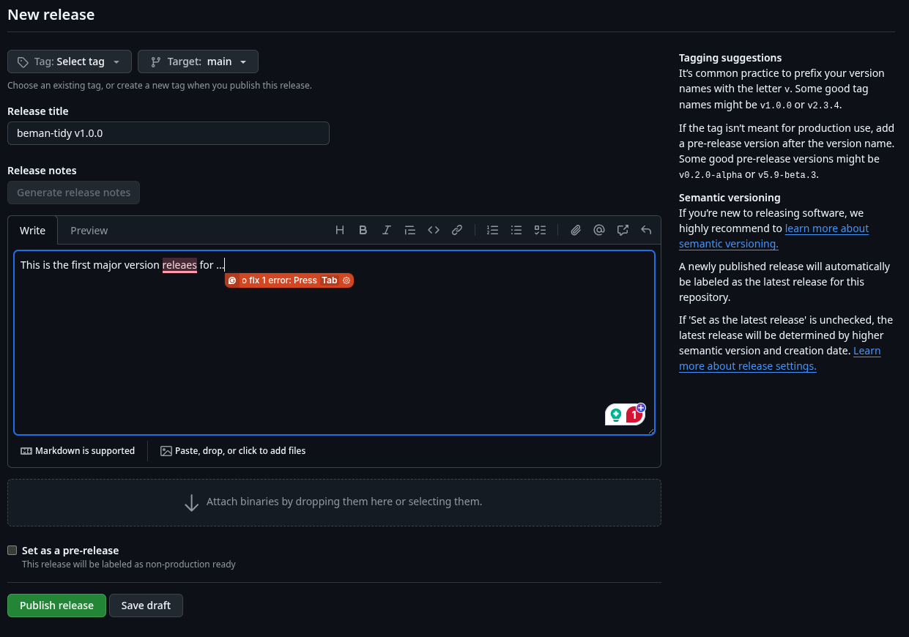

# Releasing beman-tidy to PyPI

PyPI is where Python tools are distributed. Therefore, it is where [beman-tidy](https://pypi.org/project/beman-tidy/) is officially published.

## Steps

1. Standard release engineering
    - Bump version in [`pyproject.toml`](../pyproject.toml)
    - Tag commit (don't forget to push the tag)

2. Create a release on GitHub  
    

3. Add relevant details like the good release engineer you are  
    

4. Publish the release

5. The [pipeline](../.github/workflows/publish.yml) will automatically publish to PyPI

## Recommendations as of 2025/10/01

- Currently, we are waiting for PyPI to create an organisation account for The Beman Project
- Till then, [Rishyak](https://github.com/rishyak) is managing the releases
- Email him to run up a new release
